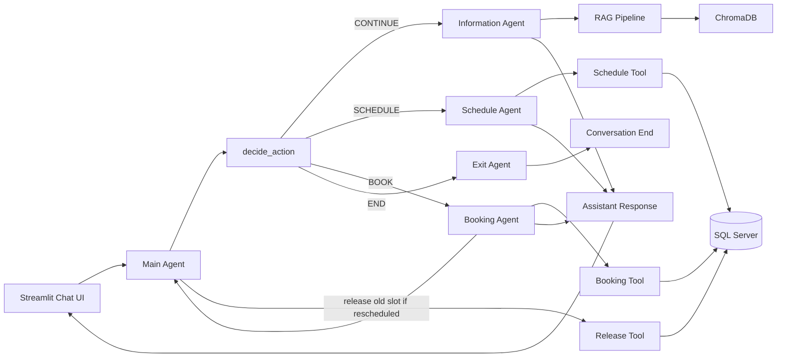
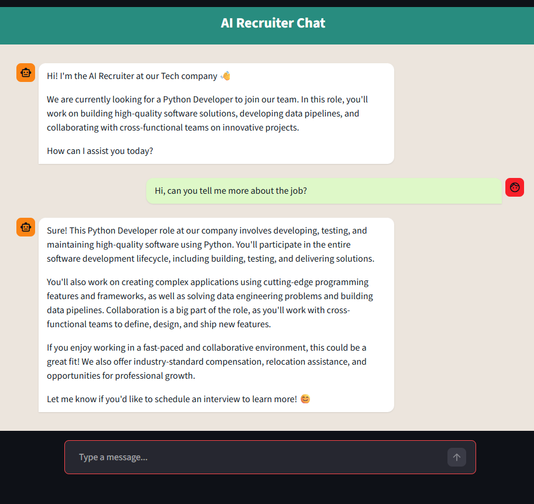
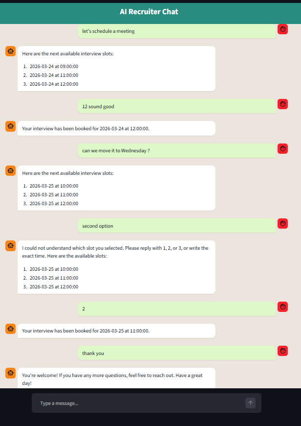

# 🤖 AI Recruiter – Interview Scheduling Assistant

**AI-powered recruitment chatbot for Python Developer roles that answers job questions and manages interview scheduling**

## 📑 Table of Contents

- [🎯 What This Does](#-what-this-does)
- [🔥 Key Features](#-key-features)
- [🏗️ How It Works](#️-how-it-works-backend-architecture)
- [⚙️ Backend Components](#️-backend-components)
- [💻 Frontend](#-frontend--user-interface)
- [🚀 Quick Start](#-quick-start)
- [📖 Usage](#-usage)
- [📁 Project Structure](#-project-structure)
- [🛠️ Tech Stack](#️-tech-stack)
- [🎯 Use Cases](#-use-cases)
- [⚠️ Current Limitations](#️-current-limitations)
- [🚀 Future Improvements](#-future-improvements)
- [📸 Screenshots](#-screenshots)
- [🤝 Contributing](#-contributing)
- [📝 License](#-license)
- [📬 Contact](#-contact)
- [🙏 Acknowledgments](#-acknowledgments)


## 🎯 What This Does

Transform the recruitment process into an intelligent, automated conversation:

- Ask questions about a job → AI answers using RAG (based on a job description PDF)  
- Understand user intent → Routes the conversation using a multi-agent system  
- Schedule interviews → Suggests available time slots from a database  
- Book interviews → Allows selection via simple inputs (e.g., 1 / 2 / 3)  
- Reschedule seamlessly → Updates bookings while keeping system state consistent 

## 🔥 Key Features

- 📄 RAG-based Job Q&A – Answers questions using a job description PDF and ChromaDB  
- 🧠 Multi-Agent System – Router, information, scheduling, booking, and exit agents  
- 🗓️ Smart Scheduling – Retrieves available interview slots from SQL Server  
- 🔢 Simple Slot Selection – Users can select options using 1 / 2 / 3  
- 🔁 Rescheduling Support – Allows changing interview times without conflicts  
- 💬 Context Awareness – Remembers if an interview is already booked  
- ⚡ Streamlit Chat UI – Interactive WhatsApp-style interface  
- 🧪 Modular Architecture – Clean separation between agents, tools, and RAG pipeline  


## 🏗️ How It Works (Backend Architecture)

The system is built using a multi-agent architecture that dynamically routes user intent and executes the correct action.



### Flow Explanation

1. **User Input** → Received via Streamlit chat UI  
2. **Router Agent** → Classifies intent (CONTINUE / SCHEDULE / BOOK / END) using rule-based logic + LLM  
3. **Information Agent** → Uses RAG to answer job-related questions based on the job description  
4. **Schedule Agent** → Retrieves future available interview slots from the database  
5. **Booking Agent** → Books the selected slot and updates availability  
6. **Release Tool** → Frees the previous slot during rescheduling (only after successful booking)  
7. **Exit Agent** → Handles conversation termination  

### Data Flow

- **Job description** → Converted into embeddings → Stored in ChromaDB  
- **User question** → Relevant chunks retrieved → LLM generates grounded answer  
- **Scheduling** → SQL query returns available future slots (2026 only, Sunday–Thursday, 09:00–17:00, excluding same-day slots)   
- **Booking** → Selected slot updated in DB (`available = 0`)  
- **Rescheduling** → New slot booked → Old slot released (`available = 1`) 


## ⚙️ Backend Components

The system relies on modular prompt templates to guide LLM behavior across different agents, including routing, information retrieval, scheduling, and exit handling.  
These prompts are located in the `app/prompts` directory and ensure consistent and controlled responses.

### 1. Main Orchestrator (`app/agents/main_agent.py`)

The `main_agent` is the central controller of the system.  
It receives the user message, determines the user's intent, routes the request to the correct agent, and returns the updated conversation state.

**Responsibilities:**
- Routes the conversation into one of four actions: `CONTINUE`, `SCHEDULE`, `BOOK`, or `END`
- Uses both rule-based logic and an LLM-based router for intent detection
- Passes job-related questions to the Information Agent
- Passes scheduling requests to the Schedule Agent
- Passes slot selection requests to the Booking Agent
- Passes exit messages to the Exit Agent
- Keeps track of:
  - `last_offered_slots`
  - `booked_slot`
- Prevents already booked slots from being offered again during rescheduling
- Releases the previous slot only after a new slot is successfully booked

```python
def decide_action(user_message: str, history: list) -> str:
    # Determines the next step in the conversation:
    # CONTINUE / SCHEDULE / BOOK / END

def main_agent(
    user_message: str,
    history: list,
    last_offered_slots: list,
    booked_slot: dict | None,
) -> tuple[str, list, dict | None]:
    # Main orchestration flow:
    # 1. Detect user intent
    # 2. Route to the relevant agent
    # 3. Return response and updated state
```

### 2. Information Agent (`app/agents/information_agent.py`)

The Information Agent is responsible for answering user questions about the job role using a RAG (Retrieval-Augmented Generation) pipeline.

**Responsibilities:**
- Handles general conversation and job-related questions
- Uses RAG to retrieve relevant context from the job description (stored in ChromaDB)
- Builds a prompt that includes:
  - Recent conversation history
  - Retrieved context
  - Current interview status
- Generates a grounded response using an LLM
- Adjusts responses based on whether the user already has an interview scheduled

**Special Logic:**
- Detects greeting messages (e.g., "hi", "hello")
- If an interview is already scheduled:
  - Informs the user about their existing booking
  - Suggests rescheduling instead of scheduling again
- If no interview is scheduled:
  - Encourages scheduling at the end of the response

```python
def information_agent(user_message: str, history: list, booked_slot: dict | None = None) -> str:
    # Uses RAG to answer job-related questions
    # Incorporates conversation history and interview status
```

### 3. Schedule Agent (`app/agents/schedule_agent.py`)

The Schedule Agent is responsible for retrieving available interview slots based on the user's request.

**Responsibilities:**
- Detects whether the user is making:
  - A general scheduling request (e.g., "schedule", "reschedule", "another time")
  - A specific date/time request
- For general requests:
  - Skips date extraction
  - Retrieves the next available future slots directly
- For specific requests:
  - Uses an LLM to extract structured date and time from natural language
- Calls the scheduling tool to fetch available slots from the database
- Returns a formatted list of available interview slots

**Special Logic:**
- Supports rescheduling by treating it as a generic scheduling request
- Avoids relying on user-provided dates when intent is general
- Ensures consistent formatting of returned slots (indexed list)

```python
def extract_datetime(user_message: str) -> dict:
    # Uses LLM to extract structured date and time from user input

def schedule_agent(user_message: str) -> tuple[str, list]:
    # Determines whether to extract date/time or return next available slots
    # Calls schedule_tool to retrieve available slots
    # Returns formatted response + slots
```

### 4. Booking Agent (`app/agents/booking_agent.py`)

The Booking Agent is responsible for selecting and booking an interview slot מתוך האפשרויות שהוצעו למשתמש.

**Responsibilities:**
- Validates that available slots exist in memory (`last_offered_slots`)
- Detects which slot the user selected
- Supports multiple selection methods:
  - Option number (e.g., `1`, `2`, `3`)
  - Natural language (e.g., "first", "second")
  - Time-based selection (e.g., "14:00")
- Calls the booking tool to reserve the selected slot in the database
- Returns a confirmation message along with the booked slot

**Special Logic:**
- Prioritizes selection by option index (1 / 2 / 3)
- Falls back to time-based matching if no option is detected
- Handles invalid selections with clear guidance to the user
- Prevents out-of-range selections
- Handles race conditions (slot already taken)

```python
def booking_agent(user_message: str, last_offered_slots: list) -> tuple[str, dict | None]:
    # Detects selected slot (by index or time)
    # Calls booking_tool to reserve slot
    # Returns confirmation + booked slot
```

### 5. RAG Pipeline (`app/rag/rag_chain.py`)

The RAG (Retrieval-Augmented Generation) pipeline is responsible for answering user questions based on the job description.

**Responsibilities:**
- Retrieves relevant document chunks from ChromaDB using a retriever
- Builds a context from the retrieved documents
- Constructs a prompt that restricts the LLM to answer only from the provided context
- Calls the LLM to generate a grounded response
- Returns both the answer and the supporting context

**Special Logic:**
- Limits retrieval to top-k relevant chunks (`k=3`)
- Ensures the model does not hallucinate:
  - If the answer is not found → returns a fallback message
- Returns full traceability:
  - Retrieved documents
  - Context used
  - Final answer


```python
def ask_rag(question: str):
    # Retrieves relevant chunks from ChromaDB
    # Builds context
    # Sends prompt to LLM
    # Returns answer + context + documents
```

### 6. Schedule Tool (`app/tools/schedule_tool.py`)

The Schedule Tool is responsible for querying the SQL Server database and returning the next available interview slots.

**Responsibilities:**
- Connects to the database using `get_connection()`
- Retrieves available interview slots from `dbo.Schedule`
- Filters by:
  - `position`
  - `available = 1`
  - Future dates and times
- Excludes slots from the current day
- Returns a limited number of results (`limit=3`) ordered by date and time

**Special Logic:**
- Only returns slots for the relevant role (`Python Dev`)
- Ensures results are sorted chronologically
- Converts SQL rows into a clean Python list of dictionaries

**Constraints:**
- Works with interview data for the year 2026  
- Only considers working days (Sunday–Thursday)  
- Working hours: 09:00–17:00  
- Always returns **future slots only** (never shows same-day availability) 

```python
def get_next_slots(req_date, req_time, position="Python Dev", limit=3):
    # Queries SQL Server for available future interview slots
```

### 7. Schedule Tool Wrapper (`app/tools/schedule_tool_langchain.py`)

Wraps the scheduling function as a LangChain tool, allowing it to be invoked by agents in a structured way.

**Responsibilities:**
- Converts the `get_next_slots` function into a LangChain-compatible tool
- Defines clear input requirements (`req_date`, `req_time`)
- Provides a description used by the LLM for tool selection
- Enables seamless integration between agents and database queries

```python
schedule_tool = StructuredTool.from_function(
    func=get_next_slots,
    name="Interview Scheduler",
    description=(
        "Get the next available interview slots for a Python Developer. "
        "Input must include: "
        "'req_date' (YYYY-MM-DD) and 'req_time' (HH:MM:SS). "
        "Returns a list of available slots."
    )
)
```

### 8. Booking Tool (`app/tools/booking_tool.py`)

The Booking Tool is responsible for reserving a selected interview slot in the database.

**Responsibilities:**
- Connects to the database using `get_connection()`
- Updates the selected slot in `dbo.Schedule`
- Sets `available = 0` only if the slot is still available
- Returns `True` if booking succeeded, otherwise `False`

**Special Logic:**
- Prevents double-booking by updating only rows where `available = 1`
- Uses `cursor.rowcount` to verify whether the booking actually succeeded

```python
def book_slot(req_date, req_time, position="Python Dev") -> bool:
    # Books a specific slot only if it is still available
```

### 9. Booking Tool Wrapper (`app/tools/booking_tool_langchain.py`)

Wraps the booking function as a LangChain tool, enabling agents to invoke it in a structured and consistent way.

**Responsibilities:**
- Converts the `book_slot` function into a LangChain-compatible tool
- Defines required inputs (`req_date`, `req_time`)
- Provides a clear description for the LLM to understand when to use this tool
- Enables seamless interaction between the Booking Agent and the database layer

```python
booking_tool = StructuredTool.from_function(
    func=book_slot,
    name="Interview Booking Tool",
    description=(
        "Book an interview slot. "
        "Input must include: "
        "'req_date' (YYYY-MM-DD) and 'req_time' (HH:MM:SS). "
        "Returns True if booking succeeded, False otherwise."
    )
)
```

### 10. Release Tool (`app/tools/release_tool.py`)

The Release Tool is responsible for freeing a previously booked interview slot during the rescheduling process.

**Responsibilities:**
- Connects to the database using `get_connection()`
- Updates the selected slot in `dbo.Schedule`
- Sets `available = 1` to make the slot available again
- Returns `True` if the release operation succeeded, otherwise `False`

**Special Logic:**
- Used only after a new slot has been successfully booked
- Prevents losing the original slot before confirming a new booking
- Ensures consistent and safe rescheduling flow

```python
def release_slot(req_date, req_time, position="Python Dev") -> bool:
    # Releases a previously booked slot and makes it available again
```

### 11. Release Tool Wrapper (`app/tools/release_tool_langchain.py`)

Wraps the release function as a LangChain tool, enabling agents to invoke it as part of the rescheduling flow.

**Responsibilities:**
- Converts the `release_slot` function into a LangChain-compatible tool
- Provides a clear description for when the tool should be used
- Enables integration with agent-based workflows

```python
release_tool = StructuredTool.from_function(
    func=release_slot,
    name="Release Interview Slot Tool",
    description="Release a booked interview slot and make it available again."
)
```

## 💻 Frontend / User Interface

The project includes a Streamlit-based chat interface that simulates a real conversation with an AI recruiter.

### Frontend Flow

1. **Page Initialization** → Streamlit loads the app and applies custom page settings  
2. **Custom Styling** → A WhatsApp-inspired design is applied using CSS  
3. **Session State Management** → Conversation history, offered slots, and booked slot are stored in `st.session_state`  
4. **Chat Rendering** → Previous user and assistant messages are displayed in the chat window  
5. **User Input** → The user sends a message through `st.chat_input()`  
6. **Main Agent Invocation** → The input is passed to `main_agent()` together with the current conversation state  
7. **State Update** → Returned values update:
   - `messages`
   - `last_offered_slots`
   - `booked_slot`
8. **Assistant Response Rendering** → The assistant reply is displayed in the chat UI  

### Frontend Components

#### 1. Streamlit App (`streamlit/ai_app.py`)

The main Streamlit application manages the chat interaction and connects the UI to the backend agents.

**Responsibilities:**
- Configures the page layout and title
- Applies custom WhatsApp-style UI
- Initializes session state variables
- Displays chat history
- Receives user input from the chat box
- Sends user messages to the backend orchestrator
- Updates session state with:
  - conversation history
  - offered slots
  - booked interview slot
- Renders assistant responses in real time

```python
response, offered_slots, booked_slot = main_agent(
    user_input,
    st.session_state.messages,
    st.session_state.last_offered_slots,
    st.session_state.booked_slot
)
```

#### 2. UI Styling (`streamlit/whatsapp_style.py`)

This file defines the custom chat design used by the Streamlit app.

**Responsibilities:**
- Applies a WhatsApp-inspired layout and color palette  
- Styles the page background, header, message bubbles, and input box  
- Differentiates between user and assistant messages  
- Supports left/right alignment for chat bubbles  
- Includes an optional custom HTML-based chat renderer  

**Design Features:**
- Green user message bubbles  
- White assistant message bubbles  
- Fixed top header  
- Mobile-like chat layout  
- Styled chat input area  

```python
def apply_whatsapp_style():
    # Injects custom CSS for the chat UI
```

## 🚀 Quick Start

Follow these steps to run the AI Recruiter locally.

### Prerequisites

- Python 3.8+
- pip
- OpenAI API key
- SQL Server 

---

### 1. Clone the Repository

```bash
git clone https://github.com/NataElk/ai-recruiter-project.git
cd ai-recruiter-project
```

### 2. Install Dependencies

```bash
pip install -r requirements.txt
```

### 3. Set Environment Variables

Create a .env file in the root directory:

```md
OPENAI_API_KEY=your_api_key_here
```

### 4. Setup Database

Make sure your SQL Server is running and create the `Schedule` table.

Then run:

```sql
-- Run the script:
app/db/db_Tech.sql
```

### 5. Build Vector Database (ChromaDB)

```bash
python -m tests.test_build_vector_store
```

This step:

- Loads the job description PDF

- Splits it into chunks

- Creates embeddings

- Stores them in ChromaDB

### 6. Run the Application

```bash
streamlit run streamlit/ai_app.py
```

### 7. Open in Browser

```bash
http://localhost:8501
```

### ✅ You're Ready

You can now:

- Ask questions about the job  
- Schedule an interview  
- Select a slot (1 / 2 / 3)  
- Reschedule if needed 


## 📖 Usage

The AI Recruiter provides a conversational interface for interacting with the recruitment system.

Users can:

- Ask questions about the job role and receive answers based on the job description (RAG)  
- Request to schedule an interview and receive available time slots  
- Select a preferred slot using simple inputs (e.g., option number or time)  
- Reschedule an existing interview while maintaining system consistency  
- End the conversation at any point  

The system dynamically routes user intent using a multi-agent architecture and maintains conversation context throughout the interaction.

## 📁 Project Structure
```text
ai-recruiter-project/
├── .gitignore                         # Specifies files to ignore in version control
├── README.md                          # Project documentation
├── LICENSE                            # License information
├── requirements.txt                   # Python dependencies
├── .venv/                             # Virtual environment (ignored by git)
├── .env                               # Environment variables (ignored by git)
│
├── app/                               # Main backend application
│   ├── __init__.py                    # Marks app as a Python package
│   │
│   ├── agents/                        # Agent layer (conversation logic)
│   │   ├── __init__.py                # Agents package initializer
│   │   ├── booking_agent.py           # Handles slot selection and booking
│   │   ├── exit_agent.py              # Handles conversation termination
│   │   ├── information_agent.py       # Answers job-related questions (RAG)
│   │   ├── main_agent.py              # Main orchestrator (routing logic)
│   │   └── schedule_agent.py          # Retrieves available interview slots
│   │
│   ├── data/                          # Static project data
│   │   └── job_description.pdf        # Source document for RAG
│   │
│   ├── db/                            # Database layer
│   │   ├── __init__.py                # DB package initializer
│   │   ├── db_connection.py           # SQL Server connection handler
│   │   └── db_Tech.sql                # Database schema and seed data
│   │
│   ├── prompts/                       # Prompt templates for LLM behavior
│   │   ├── exit_prompt.py             # Prompt for exit handling
│   │   ├── info_prompt.py             # Prompt for RAG responses
│   │   ├── router_prompt.py           # Prompt for intent classification
│   │   └── schedule_prompt.py         # Prompt for date/time extraction
│   │
│   ├── rag/                           # Retrieval-Augmented Generation pipeline
│   │   ├── __init__.py                # RAG package initializer
│   │   ├── load_documents.py          # Loads and processes PDF
│   │   ├── rag_chain.py               # Main RAG pipeline logic
│   │   ├── retriever.py               # Retrieves relevant chunks
│   │   └── vector_store.py            # ChromaDB vector storage
│   │
│   ├── tools/                         # Tool layer (DB operations)
│   │   ├── __init__.py                # Tools package initializer
│   │   ├── booking_tool.py            # Books interview slots
│   │   ├── booking_tool_langchain.py  # LangChain wrapper for booking
│   │   ├── release_tool.py            # Releases previously booked slots
│   │   ├── release_tool_langchain.py  # LangChain wrapper for release
│   │   ├── schedule_tool.py           # Fetches available slots
│   │   └── schedule_tool_langchain.py # LangChain wrapper for scheduling
│   │
│   └── utils/                         # Shared utilities
│       ├── __init__.py                # Utils package initializer
│       ├── config.py                  # Configuration settings
│       └── llm_factory.py             # LLM initialization
│
├── streamlit/                         # Frontend (UI layer)
│   ├── ai_app.py                      # Main Streamlit chat application
│   └── whatsapp_style.py              # Custom WhatsApp-style UI
│
├── chroma_db/                         # Vector database storage (ChromaDB)
├── tests/                             # Testing and evaluation
    ├── test_evals.ipynb               # Evaluation notebook for system performance
    └── other_tests.py                 # Additional test scripts and unit tests


```

## 🛠️ Tech Stack

The system is built using modern tools and frameworks for building AI-powered applications:

- **Frontend:** Streamlit – Interactive chat-based UI  
- **LLM Integration:** OpenAI API – Natural language understanding and generation  
- **Orchestration:** LangChain – Agent routing and tool integration  
- **RAG Pipeline:** ChromaDB – Vector database for document retrieval  
- **Embeddings:** OpenAI Embeddings – Semantic search over job description  
- **Database:** SQL Server – Stores interview slots and availability  
- **Architecture:** Multi-Agent System – Modular and scalable design

## 🎯 Use Cases

- **HR Teams**: Automate candidate communication and interview scheduling  
- **Tech Companies**: Streamline hiring for Python Developer roles  
- **Startups**: Manage recruitment without complex ATS systems  
- **Individual Recruiters**: Conduct structured interview scheduling through a conversational interface  
- **AI Projects**: Demonstrate RAG and multi-agent orchestration in a real-world application  

## ⚠️ Current Limitations

- The system currently supports a **single user session** (no multi-user support)  
- Conversation state is stored locally using Streamlit session state  
- No authentication or user management is implemented  
- Designed as a prototype / demo system 

## 🚀 Future Improvements

- Multi-user support with authentication  
- Persistent user sessions using a database  
- Admin dashboard for recruiters  
- Integration with external ATS systems  
- Deployment to cloud environments (AWS / Azure / GCP)  

## 📸 Screenshots

### Chat Interface



### Scheduling Flow




## 📝 License

This project is open source and available under the MIT License.

## 👨‍💻 Author

**Natalie Elkin**  
📧 natalie.elkin1@gmail.com  

**Sara Schwartz**  
📧 Sarah@quantum360.co.il

GitHub Repository: [NataElk/ai-recruiter-project](https://github.com/NataElk/ai-recruiter-project)

---

## 🙏 Acknowledgments

- [OpenAI](https://platform.openai.com/docs/overview) – LLM and embeddings  
- [Streamlit](https://streamlit.io/) – Frontend framework  
- [LangChain](https://www.langchain.com/) – Agent orchestration  
- [ChromaDB](https://www.trychroma.com/) – Vector database

⭐ **Star this repo** if you found it helpful!